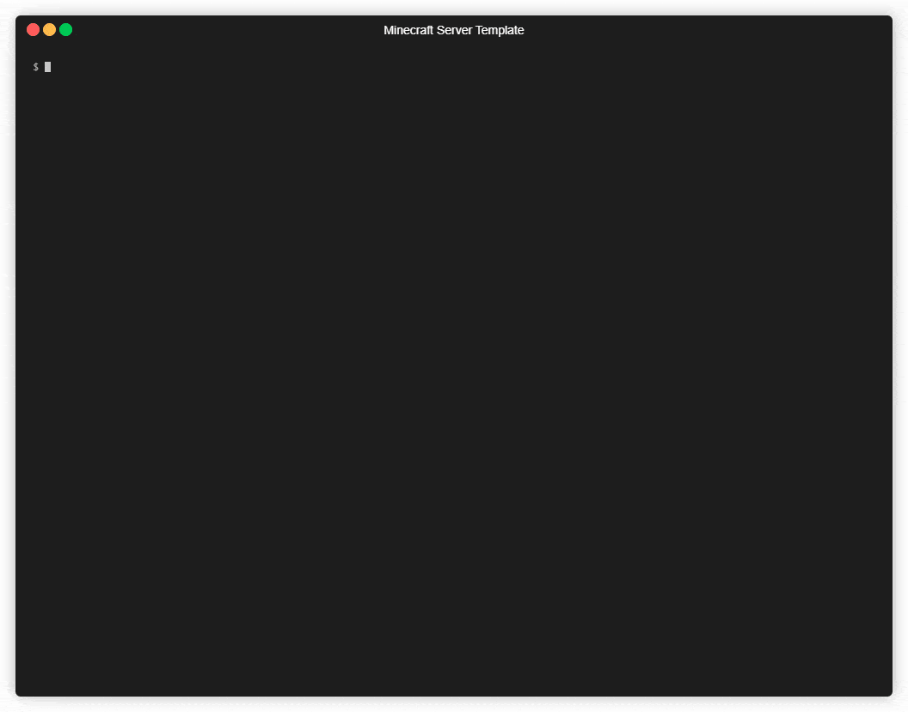
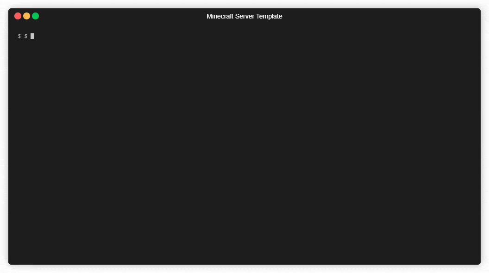

# Minecraft Server Template

[](https://www.spigotmc.org/resources/88587/)
[](https://www.spigotmc.org/resources/88587/)

Use this repository to quickstart your own Minecraft server network using docker and git managed configs.



* [Features](#features)
* [Prerequisites](#prerequisites)
* [Getting started](#getting-started)
* [Console & CMD](#console--cmd)
* [Server](#server)
  * [Directory layout](#directory-layout)
  * [Updating plugin configs](#updating-plugin-configs)
  * [Installing/Updating plugins](#installingupdating-plugins)
  * [Adding more servers](#adding-more-servers)
* [Database](#database)
* [Dynmap](#dynmap)
* [Player Analytics](#player-analytics)
* [Backup](#backup)
* [Web Traefik](#web-traefik)
* [Developer Setup](#developer-setup)
  * [Logs and Reboot](#logs-and-reboot)
  * [phpMyAdmin](#phpmyadmin)
  * [OP Rights](#op-rights)
  * [Copying plugins](#copying-plugins)
  * [Debugging](#debugging)
* [FAQ](#faq)
  * [View the 'live' server log](#view-the-live-server-log)

## Features

* Full minecraft network setup using latest [paper-spigot](https://papermc.io/) and [waterfall](https://github.com/PaperMC/Waterfall) builds.
  *Using other distrubutions, like forge, sponge or veolicty is completly up to you. Just edit the `globals.env`*
* Up and running standalone [dynmap](https://www.spigotmc.org/resources/dynmap.274/) configuration with custom subdomain.
* Ready to use [Player Analytics (Plan)](https://www.spigotmc.org/resources/plan-player-analytics.32536/) integration with custom subdomain.
* Usage of the [official minecraft docker](https://github.com/itzg/docker-minecraft-server) images from itzg with all config options.
* Integrated [MariaDB](https://hub.docker.com/_/mariadb) database with not exposed public port for enhanced security.
* [phpMyAdmin](https://hub.docker.com/r/phpmyadmin/phpmyadmin/) for accessing the database.
* [RCON Web Interface](https://hub.docker.com/r/itzg/rcon) for easy console access on the go.
* Full git workflow for managing configurations. Easy rollbacks and change tracking of all configurations.
* Replacement of sensentive config information when the server starts. See [itzg/minecraft-server](https://github.com/itzg/docker-minecraft-server#replacing-variables-inside-configs) for details.
* Integrated [backup container](https://hub.docker.com/repository/docker/silthus/mc-restic-compose-backup) for local, remote or cloud backups running every three hours by default.
* Minecraft world integrity is ensured when backing up by turning auto-save off before and on again after backup.
* Adding more servers to the network is as easy as copying some files.
* Integrated webserver on custom subdomain to host downloads, e.g. images, plugins.
* All webservers and external domains are HTTPS enforced and secured with a letsencrypt certificate.
* Development server to create a minimal clone of the production server.

## Prerequisites

Make sure that the following packages are installed and working on your system:

* The latest version of [docker](https://docs.docker.com/engine/install/ubuntu/)
* The latest version of [docker-compose](https://docs.docker.com/compose/install/)
* *(Optional)*: **unzip** to download and unzip the initial plugins

## Getting started

1. Use this [repository as a template](https://github.com/Silthus/minecraft-server-template/generate) to create your own and then clone it:
   `git clone https://github.com/Silthus/minecraft-server-template.git`
2. Execute the `init.sh` script:  
   *The script asks you a couple of questions initializing your minecraft network.*  
   *It will also generate a couple of `*.secrets.env` files that **must never be commited!***
3. Start the network with `./dc.sh up -d`.

## Console & CMD

The console is accessible over a RCON webinterface or the `console.sh` script.

`main` is the name of the server the console should attach to.

```bash
./console.sh main
```

Additionally there is the option to directly execute commands without mounting the console using the `cmd.sh` script.

```bash
./cmd.sh main op Silthus
```


## Server

The server can be started `./dc.sh up -d` and stopped with `./dc.sh down`.
To restart the server container use `./dc.sh restart main`. Where `main` is again the name of the server container.

> At the start of the server all contents of `plugins/` are copied into the servers data directory and overwrite any config there.  
> Everything from `configs/` will be copied into the root data directory of the server.

All live data, worlds, flatfiles, plugins and so on live under the `servers/` directory. There you can also find the `latest.log` of the server.

```bash
less +F servers/main/logs/latest.log
```

Exit the log file with `CTRL+C Q`. See `man less` for more details.
As an alternative you can also attach to one or multiple of the docker containers.

```bash
./dc logs -f main proxy
```

### Directory layout

Here is an overview of the directory structure of your server nework. The `plugins` and `proxy-plugins` directory can be swapped with a git submodule if your server grows larger or you want to split the commit messsages and repository access.

| Directory | Details |
| ------- | -------- |
| `configs/` | Contains the base server configurations, e.g. `bukkit.yml`. The `server-properties` must be configured in the `/server-properties.env`. |
| `database/` | Contains the `MariaDB` database files. Do not touch them and don't include them in your git repository. |
| `downloads/` | An optional webserver to serve the latest zip file of your plugins for the local development server. |
| `dynmap/` | Contains the web and tiles directory of your dynmap render - if needed. |
| `plugins/` | All plugin configs that derive from the default configs should be placed and configured here. **Do not include flat file storage, like the Citiziens saves.yml!**. Drop your plugin `*.jar` files into this directory as well. |
| `proxy-plugins/` | This is the same as the `plugins/` directory, just for the bungeecord/velocity plugins. Drop your proxy plugin `*.jar` files into the directory. |
| `rcon/` | Contains the data of the rcon web interface. Do not touch it or include it in the git repository. |
| `schematics/` | A directory to share schematics across servers in your network. It must be mounted for each server and map to the WorldEdit schematics directory. |
| `scripts/` | Contains utlity scripts used by the `init.sh` script. Feel free to add your own and customize it to your liking. |
| `servers/` | Contains the flesh and bones of your server and holds all data. Do not commit them to the repository, but make sure to keep regular backups using the built-in restic backup or your own. |
| `docker-compose.*.yml` | There is one file for each service deployed in your minecraft network. Add or remove them as required. |
| `*.env` | The env files contain individual settings for each container, e.g. RAM, gamemode, etc. |
| `*.secrets.env` | Contains generated secrets for your network. **Do not commit them to source control!** |

### Updating plugin configs

All plugin configurations are located inside the `plugins/` directory and copied to the `servers/.../plugins/` on start of the server. Only place the configs that derive from the defaults. Do not place flat files in there, e.g. Citizens `saves.yml`. Files in the `plugins/` directory overwrite your files in the `servers/...` directory on startup.

You can use the [variable replacements](https://github.com/itzg/docker-minecraft-server#replacing-variables-inside-configs) from the official `minecraft-docker` image.

Here is an example database configuration which will automatically replace the variables with your database credentials on startup. See the `globals.env` for details.

```yaml
database:
  type: ${CFG_DB_DRIVER}
  host: ${CFG_DB_HOST}
  port: ${CFG_DB_PORT}
  user: ${CFG_DB_USER}
  password: ${CFG_DB_PASSWORD}
  database: ${CFG_DB_NAME}
  url: ${CFG_DB_URL}
```

### Installing/Updating plugins

Drop the `.jar` files of your plugins into the `plugins/` directory. They will be copied together with the configs into the `servers/` directory on startup. Any old *.jar files will be removed. You can finetune the deletion depth in the `globals.env` with the `REMOVE_OLD_MODS_DEPTH` property.

By default this means that nested jar files, e.g. the ones from `PlaceholderAPI` will be deleted as well. Include them in the `plugins/` directory under `plugins/PlaceholderAPI/expansions/`.

After you updated plugins you can execute the `zip-plugins.sh` script to create a zip file of all of your plugins that is then available for download and use in the testserver.

### Adding more servers

You can add more servers any time. Just copy the `docker-compose.main.yml` and replace every occurance of `main` with your new server name. Create a custom `<your-server>.env` file to override additional properties and include in the in the `env-files:` part of the compose config. Also update the name of your world by setting the `LEVEL:` property.

Copy the `configs/main/` directory and adjust the `bukkit.yml` and so on.

Create a new empty directory with the name of your server under: `servers/<your-server>`.

## Database

The setup will deploy a [MariaDB](https://hub.docker.com/_/mariadb) docker image with a random `root` and `minecraft` user password. Only the password of the minecraft user is stored in the `mysql.secrets.env`. You must look at the first startup log of the db container and note the root password to manually create new users: `./dc.sh logs db`.

There is also a phpyMyAdmin deployment available under `db.your-server.net`. You can login with the users above. Creating new users to access the database from the web is highly recommended.

## Dynmap

The stack will be deploy with a standalone dynmap webserver and dynmap has to be configured accordingly. To make things easier this template comes with a dynmap `configuration.txt` and preconfigured web directory that works out of the box.

To enable the dynmap integration download the [dynmap plugin](https://www.spigotmc.org/resources/dynmap.274/) and drop it into the `plugins/` directory. The dynmap can then be accessed using `https://map.your-server.net`.

## Player Analytics

Download the[player analytics](https://www.spigotmc.org/resources/plan-player-analytics.32536/) plugin drop it into the `plugins/` and `proxy-plugins/` directory. Restart your server and access PLAN under `plan.your-server.net`.

## Backup

The stack comes with a [restic](https://restic.readthedocs.io/) backup [sidecar container](https://hub.docker.com/repository/docker/silthus/mc-restic-compose-backup) which allows configuring any number of [backup repositories](https://restic.readthedocs.io/en/stable/030_preparing_a_new_repo.html). [AWS glacier](https://aws.amazon.com/glacier/) can be configured easily, as it is very cheap for huge amount of data.

By default backups are written into the `backup/` directory. Adjust the `backup.env` file to your liking. You can also add a discord webhook to one of your discord channels to get notified when a backup occured. This way you can quickly see if backups are successful or failing.

To get the status of your backups attach to the backup container and run `rcb status` and `rcb snapshots`.

``./backup.sh attach``

You can also use the `backup.sh` script to create an instant backup or cleanup the repository based on your retention times in `backup.env`.

* ``./backup.sh now`` - *Takes an instant backup.*
* ``./backup.sh cleanup`` - *Removes old snapshots freeing disk space.*
* ``./backup.sh snapshots`` - *Shows all backups.*
* ``./backup.sh attach`` - *Attaches to the backup container. Use the `rcb` command inside for more details.*



## Web Traefik

[Traefik](https://doc.traefik.io/traefik/) is used to dynamically serve urls, create certificates and make the various web sites accessible under their subdomains.

## Developer Setup

One of the mail goals of this project was to make mirroring the production server to a development environment as easy as possible. At the same time should the local development environment not eat up all local resources. For that reason there is a `minimal.sh` setup of the server. It only serves the required docker services and makes the phpMyAdmin accessible on [http://localhost:8080](http://localhost:8080) without login.

> All of the following steps must be executed inside a `Windows Subsystem for Linux (WSL)` or Linux environment. `Docker for Windows` must also be installed and have the [WSL2 integration activated](https://docs.docker.com/docker-for-windows/wsl/). Depending on your system you must also activate CPU virtualization in your BIOS: [Troubleshooting Docker for Windows](https://docs.docker.com/docker-for-windows/troubleshoot/#virtualization)

1. Clone this repository with the `--recursive` flag:
   `git clone --recursive https://github.com/Silthus/minecraft-server-template.git`
2. Execute the `init.sh` script:
   *The script asks you a couple of questions initializing your minecraft network.*
   *It will also generate a couple of `*secrets.env` files that **must never be commited!**
3. Delete all non required plugins (just `.jar` files) from the `plugins/` directory.
   *This will speed up the startup time of your server signifficantly.*
4. Start the development server with the `minimal.sh` script.  
   `./minimal.sh up -d`
5. Happy coding :)

### Logs and Reboot

The logs of the dev server can be viewed with `./minimal.sh logs -f minimal`.

The server can be restarted with `./minimal.sh restart minimal` and stopped with `./minimal.sh down`.

### phpMyAdmin

The dev server has an integrated phpMyAdmin webinterface without authentication. Simply access [http://localhost:8080](http://localhost:8080).

### OP Rights

You should give yourself OP rights after joining the server: `./minimal.sh exec minimal rcon-cli op <USER>`

If using luckperms use the following command: `./minimal.sh exec minimal rcon-cli lp user <USER> permission set luckperms.autoop`

### Copying plugins

To avoid the pesky manual copying of plugins a new gradle task was created: `other -> installPlugin`.
The task will automatically build and copy your plugin into the `plugins/` directory.

You need to include the following in your `build.gradle` to make this work. The `init.sh` script did the rest and copied the task from the `lib/scripts/` directory.

```groovy
if (project.hasProperty("local_script")) {
    apply from: file(local_script + "/build.local.gradle")
}
```

### Debugging

The development server started with `minimal.sh` will automatically expose the default remote debugging port under `-agentlib:jdwp=transport=dt_socket,server=y,suspend=n,address=*:5005`.

## FAQ

### View the 'live' server log

``./dc.sh logs -f main``
